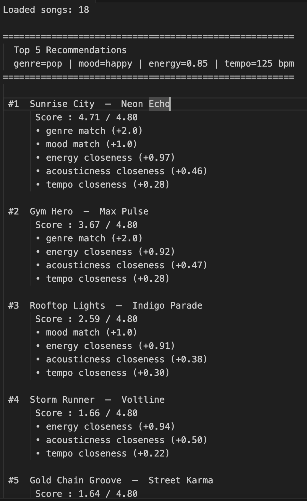
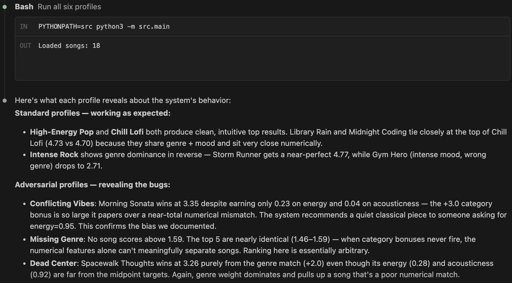

# 🎧 Model Card: Music Recommender Simulation

## 1. Model Name  

**VibeMatch 1.0**

---

## 2. Intended Use  

This recommender is designed to suggest songs based on a user's taste preferences. You tell it what genre you like, what mood you're in, and how energetic you want the music to be, and it finds the best matches from a small catalog of 18 songs.

It was built for a classroom exercise, not a real app. It's meant to help understand how scoring-based recommendation systems work. It assumes the user knows their preferences clearly and can describe them in simple terms (genre, mood, energy level).

**Not intended for:** real music apps, personalized discovery over time, or users who don't fit neatly into predefined genre/mood labels. It won't learn from you or improve over time.

---

## 3. How the Model Works  

Every song in the catalog gets a score based on how well it matches your preferences. The score has five parts:

- **Genre match**: If the song's genre matches yours exactly, it gets +2 points. If not, it gets nothing — no partial credit.
- **Mood match**: Same idea. Exact match = +1 point. No match = 0.
- **Energy closeness**: Songs closer to your target energy score higher. Max +1 point.
- **Acousticness closeness**: Songs that match how acoustic (or not) you want get up to +0.5 points.
- **Tempo closeness**: Songs with similar BPM get up to +0.3 points.

The max possible score is 4.80. Songs are ranked from highest to lowest, and the top 5 are returned as recommendations.

---

## 4. Data  

The catalog has 18 songs. Each song has: title, artist, genre, mood, energy (0–1), tempo in BPM, valence, danceability, and acousticness.

Genres included: pop, lofi, rock, ambient, jazz, synthwave, indie pop, hip-hop, r&b, classical, folk, electronic, country, metal, soul.

Some genres have multiple songs (lofi has 3, pop has 2), but most have exactly one. Genres like reggae, EDM, and Latin are completely missing. The energy values are mostly clustered at the low end (under 0.5) or high end (above 0.75), with almost no mid-range songs.

I didn't add or remove any songs from the original dataset.

---

## 5. Strengths  

The system works well when your preferences are well-represented in the catalog. If you like lofi or pop, you'll get reasonable results that actually feel right. The scoring is easy to explain — you can see exactly why each song was picked. The energy and acousticness components do a decent job separating songs within the same genre. The "Conflicting Vibes" test also showed that the system is consistent — it always follows the same rules, even when those rules produce weird results.

---

## 6. Limitations and Bias  

The biggest weakness is how much the genre bonus controls the results. Genre is worth 2 out of 4.80 points — more than 40% of the total score — and it's all-or-nothing. A user who likes indie pop will never see a pop or soul song, even if those songs match their energy and mood almost perfectly. This showed up in the "Conflicting Vibes" experiment: a user who wanted classical music but extreme high energy still got Morning Sonata as their top result. Morning Sonata is a quiet piano piece — basically the opposite of what they were asking for on every numeric feature. But the genre label alone gave it enough points to win. This kind of thing is called a filter bubble: the system keeps confirming what you already told it instead of finding what might actually fit.

---

## 7. Evaluation  

I tested six different user profiles. Three of them were "normal" — High-Energy Pop, Chill Lofi, and Intense Rock — where the genre and mood I asked for were actually in the catalog. Those mostly made sense. The other three were edge cases I used to break things: one had totally contradicting preferences (classical music but extreme energy), one asked for a genre that doesn't exist in the catalog (reggae), and one just set everything to the middle.

Here's an example of the top 5 results for a pop/happy profile:

The normal profiles worked pretty much how I expected. The lofi profile in particular gave really confident results — the top two songs were almost identical in score, which makes sense since the catalog has three lofi songs that all fit well.

What surprised me the most was the Conflicting Vibes profile. The user wanted classical music but also wanted really high energy (0.95) and low acousticness — basically the opposite of what classical songs sound like. I expected the system to pick something high-energy, but instead it gave Morning Sonata the top spot just because the genre matched. That felt wrong, and it helped me see how much the genre bonus can overpower everything else.

The reggae/missing genre profile was also interesting. When there's no genre match at all, the top 5 results were all super close in score — like 1.46 to 1.59. That basically means the system has no idea what to recommend and is just guessing based on energy values.

Here's the full terminal output for all six profiles:

---

## 8. Future Work  

1. **Make genre matching partial instead of binary.** Pop and indie pop are related. Soul and r&b are related. The system should give partial credit for similar genres instead of treating them as completely different.
2. **Add more songs to the catalog, especially mid-range ones.** Right now there are almost no songs with energy between 0.5 and 0.7. Users in that range don't get great matches.
3. **Use valence and danceability in the score.** These fields are already in the dataset but completely ignored. Valence especially seems useful for capturing mood more accurately than just a text label.

---

## 9. Personal Reflection  

Before this project I thought recommendation systems were basically just "the algorithm knows what you like." Building one from scratch made it clear how much it depends on design decisions — like how many points genre is worth, or whether mood is binary or a spectrum. The Conflicting Vibes experiment was the most eye-opening part. It showed that a recommender can be mathematically consistent and still give results that feel completely wrong to a real person. I think about Spotify or YouTube differently now — whenever I get a weird recommendation, I wonder which weight is out of balance.
